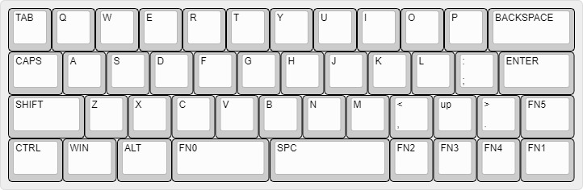
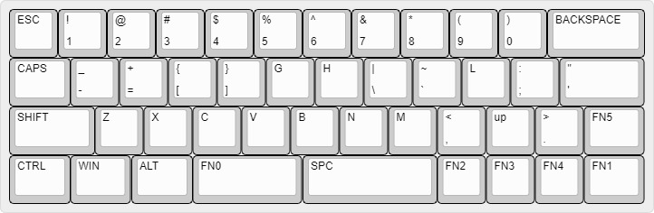
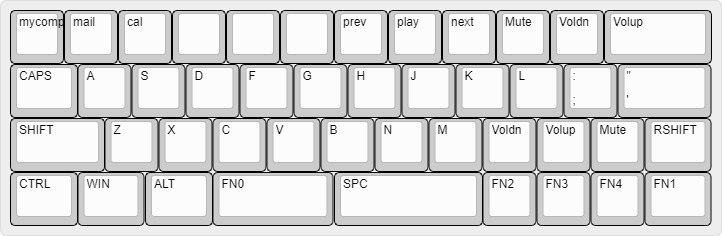

# Ω45

# Ω45 keyboard layout

## Layer 0:

["TAB","Q","W","E","R","T","Y","U","I","O","P",{w:2},"BACKSPACE"],
[{w:1.25},"CAPS","A","S","D","F","G","H","J","K","L",":\n;",{w:1.75},"ENTER"],
[{w:1.75},"SHIFT","Z","X","C","V","B","N","M","<\n,","up",">\n.",{w:1.25},"FN5"],
[{w:1.25},"CTRL",{w:1.25},"WIN",{w:1.25},"ALT",{p:"NDSA SPACE",w:2.25},"FN0",{w:2.75},"SPC","FN2","FN3","FN4",{w:1.25},"FN1"]

## Layer 1:

["ESC","!\n1","@\n2","#\n3","$\n4","%\n5","^\n6","&\n7","*\n8","(\n9",")\n0",{w:2},"BACKSPACE"],
[{w:1.25},"CAPS","_\n-","+\n=","{\n[","}\n]","G","H","|\n\\","~\n`","\"\n'",":\n;",{w:1.75},"BACKSPACE"],
[{w:1.75},"SHIFT","Z","X","C","V","B","N","M","<\n,","up",">\n.",{w:1.25},"FN5"],
[{w:1.25},"CTRL",{w:1.25},"WIN",{w:1.25},"ALT",{p:"NDSA SPACE",w:2.25},"FN0",{w:2.75},"SPC","FN2","FN3","FN4",{w:1.25},"FN1"]

## Layer 2:

["F1","F2","F3","F4","F5","F6","F7","F8","F9","F10","F11",{w:2},"F12"],
[{w:1.25},"CAPS","A","S","D","F","G","H","J","K","L",":\n;",{w:1.75},"BACKSPACE"],
[{w:1.75},"SHIFT","Z","X","C","V","B","N","M","<\n,","pgup",">\n.",{w:1.25},"FN5"],
[{w:1.25},"CTRL",{w:1.25},"WIN",{w:1.25},"ALT",{p:"NDSA SPACE",w:2.25},"FN0",{w:2.75},"SPC","home","pgdn","end",{w:1.25},"FN1"]

## Layer 3:

["mycomp","mail","cal","","","","prev","play","next","Mute","Voldn",{w:2},"Volup"],
[{w:1.25},"CAPS","A","S","D","F","G","H","J","K","L",":\n;",{w:1.75},"BACKSPACE"],
[{w:1.75},"SHIFT","Z","X","C","V","B","N","M","Voldn","up","Volup",{w:1.25},"RSHIFT"],
[{w:1.25},"CTRL",{w:1.25},"WIN",{w:1.25},"ALT",{p:"NDSA SPACE",w:2.25},"FN0",{w:2.75},"SPC","FN2","FN3","FN4",{w:1.25},"FN1"]
